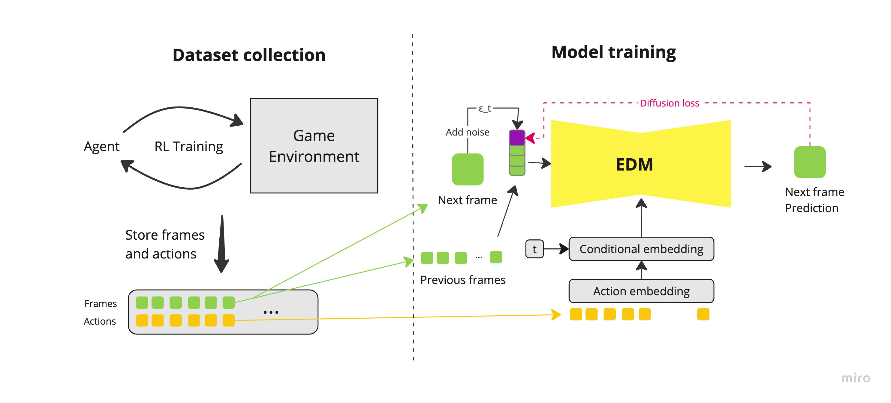

# Snake Diffusion model

It is an educational repo demonstrating how to build a real-time Snake game using a Diffusion model. It was inspired by several great papers:
* Google's Doom Diffusion ([paper](https://arxiv.org/html/2408.14837v1))
* Oasis ([github](https://github.com/etched-ai/open-oasis))
* Diamond ([paper](https://arxiv.org/pdf/2405.12399))

The goal was to create a similar implementation using Snake game due its simple logic. It took near 2 months of different experiments to get a ready-to-play model.

If you don't have GPU, you can use [runpod.io](runpod.io)(paid service).


## Model Architecture 

After several experiments, I selected the EDM diffusion model for its high performance with small sample steps. DDIM requires much more steps to achieve comparable quality.



## Installation

Install required dependencies:
```shell
pip install -r requirements.txt
```

## Training

First, obtain the training dataset using one of these methods:

1. Download the prepared dataset:
```shell
bash scripts/download-dataset.sh
```

2. Or generate it manually:
```shell
python src/generate_dataset.py --model agent.pth --dataset training_data --record
```

Then start the training:
```shell
python src/train.py --model-type edm --output-prefix models/model --dataset training_data --gen-val-images
```

The model was trained on [runpod.io](runpod.io) for 32 epochs, taking approximately 27 hours at a cost of $10.

## Inference

Download the pre-trained model:
```shell
git clone https://huggingface.co/juramoshkov/snake-diffusion models
```

To play the game, either:
1. Run [Play.ipynb](src/play.ipynb) locally to play Snake at 1 FPS(it depends on your GPU) 🤓
2. Use [runpod.io](runpod.io):
   - Deploy a Pod (RTX 4090 recommended for best performance)
   - Copy and run the contents of scripts/runpod.sh
   - Open [Play.ipynb](src/play.ipynb)
